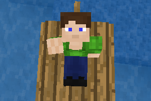

# Character Animations (`character_anim`)

Animates the character. Resembles [`playeranim`](https://github.com/minetest-mods/playeranim) and [`headanim`](https://github.com/LoneWolfHT/headanim).

## About

Depends on [`modlib`](https://github.com/appgurueu/modlib). Code written by Lars Mueller aka LMD or appguru(eu) and licensed under the MIT license.

## Screenshot

## Links

* [GitHub](https://github.com/appgurueu/character_anim) - sources, issue tracking, contributing
* [Discord](https://discordapp.com/invite/ysP74by) - discussion, chatting
* [Minetest Forum](https://forum.minetest.net/viewtopic.php?f=9&t=25385) - (more organized) discussion
* [ContentDB](https://content.minetest.net/packages/LMD/character_anim) - releases (cloning from GitHub is recommended)

## Features

* Animates head, right arm & body
* Also provides support for arbitrary player models, as long as `Head`, `Arm_Right` & `Body` bones exist
* Advantages over `playeranim`:
  * Extracts exact animations and bone positions from glTF models
  * Also animates attached players (with restrictions on angles)
* Advantages over `headanim`:
  * Provides compatibility for Minetest 5.2.0 and lower
  * Head angles are clamped, head can tilt sideways
  * Animates right arm & body as well

## Configuration

<!--modlib:conf:2-->
### `default`

#### `arm_right`

##### `radius`

* Type: number
* Default: `10`
* &gt;= -180
* &lt;= 180

##### `speed`

* Type: number
* Default: `1000`
* &gt; 0
* &lt;= 10000

##### `yaw`

###### `max`

* Type: number
* Default: `160`
* &gt;= -180
* &lt;= 180

###### `min`

* Type: number
* Default: `-30`
* &gt;= -180
* &lt;= 180

#### `body`

##### `turn_speed`

* Type: number
* Default: `0.2`
* &gt; 0
* &lt;= 1000

#### `head`

##### `pitch`

###### `max`

* Type: number
* Default: `80`
* &gt;= -180
* &lt;= 180

###### `min`

* Type: number
* Default: `-60`
* &gt;= -180
* &lt;= 180

##### `yaw`

###### `max`

* Type: number
* Default: `90`
* &gt;= -180
* &lt;= 180

###### `min`

* Type: number
* Default: `-90`
* &gt;= -180
* &lt;= 180

##### `yaw_restricted`

###### `max`

* Type: number
* Default: `45`
* &gt;= -180
* &lt;= 180

###### `min`

* Type: number
* Default: `0`
* &gt;= -180
* &lt;= 180

##### `yaw_restriction`

* Type: number
* Default: `60`
* &gt;= -180
* &lt;= 180

### `models`

Other models, same format as `default` model
<!--modlib:conf-->